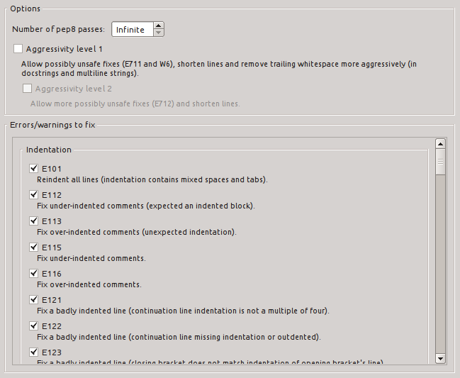

spyder-autopep8
===============

Important Notes
---------------

* This plugin is no longer maintained but you can still use with Spyder **3** (see below).
* This plugin is incompatible with Spyder **4**. However, auto-formatting was added to Spyder **4.2.0** (released in November 2020).
* To auto-format a file or selection in Spyder **4.2.0**, you need to go to the menu ``Source > Format file or selection`` or press the shortcut ``Ctrl + Alt + I`` (``Cmd + Alt + I`` in macOS).

Description
-----------

This is a plugin to run the `Autopep8 <https://pypi.python.org/pypi/autopep8>`_ Python linter from within the Python IDE `Spyder <https://github.com/spyder-ide/spyder>`_ version **3**.

Requirements
------------
::

  spyder==3
  autopep8

Install instructions
--------------------

See https://github.com/spyder-ide/spyder/wiki/User-plugins. You can only install this plugin from source and with any version of Spyder **3**.

Usage
-----

Press Shift+F8 (default) to run autopep8 on the current file or go to ``Source > Run autopep8 code autoformatting``.

If some text is selected, autopep8 will run on this text only.

Informations about the execution will be displayed in the statusbar.

Screenshot
----------
Autopep8 preferences:

